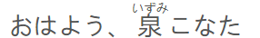

# Welcome to Simple Furigana

## This is a simple Japanese furigana tool, aligned using `&`.

_Example_:



_Source Code:_

```html
<body>
  <span id="input" style="display:none;">
    <sent>おはよう、&泉&こなた。<nota></nota>&いずみ&</sent>
  </span>
  <span id="output"></span>
</body>
```

Js File [Here](./furigana.js)
